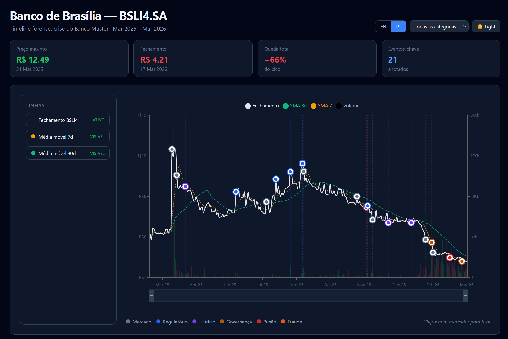

# Project: Banco Master Stock Timeline 

Link: https://projeto-timeline-banco-master.vercel.app/

## English

### About the Project
This repository contains the assets for a **Banco Master stock timeline** developed for the _Data Extraction and Preparation_ course. It combines a Python data pipeline, a lightweight Django API, and a React + Vite dashboard to help investigate how Banco Master's liquidation reverberated through Banco de Brasília (BSLI4.SA) prices.



### Architecture at a Glance
 - **`data_pipeline.py`** pulls BSLI4.SA quotes from Yahoo Finance, snaps them to the official B3 (BMF) business calendar, derives 7-day/30-day SMAs and annualized volatility, then exports `brb_market_data.json` to be used in the timeline.
 - **`rag-brb-web-scraper/`** scrapes news (incl. Google News redirects), strips noise, saves cleaned markdown, and ingests both markdown and market-data JSON into a persistent ChromaDB via `ingest.py` (Ollama nomic-embed-text). This is then used by a RAG model (Mistral) to generate `events.json` to be used in the interactive timeline.
 - **Backend:** API exposes `GET /api/market-data/` and `GET /api/events/` (routing fixed to avoid a double `/api/` prefix), serving cached JSON so the frontend and RAG clients don’t hammer upstream sources.
 - **Frontend:** **`frontend/src/App.jsx`** renders an interactive timeline with Recharts, highlighting the Banco Master liquidation window and the "Operação Compliance Zero" investigation period.

### Key Features
- **Deterministic calendar alignment** using `pandas_market_calendars` to prevent gaps on B3 holidays.
- **Rolling analytics** (SMA 7, SMA 30, 30-day volatility) ready for contagion storytelling.
- **CORS-friendly Django API** that guards against missing or corrupted caches with defensive logging.
- **Responsive React dashboard** (Tailwind + Recharts) with contextual Reference Areas, brush-based zoom, and friendly error states.

### Prerequisites
- Python 3.11+
- Node.js 20+
- Recommended Python packages: `django`, `django-cors-headers`, `pandas`, `pandas-market-calendars`, `yfinance`

### Local Setup & Usage
```bash
# 1) Create & activate a virtual environment
python -m venv .venv
.venv\Scripts\activate  # Windows

# 2) Install Python dependencies
pip install django django-cors-headers pandas pandas-market-calendars yfinance

# 3) Generate / refresh cached market data
python data_pipeline.py

# 4) Run the Django API (inside backend/)
cd backend
python manage.py migrate
python manage.py runserver 8000

# 5) Start the React client (inside frontend/)
cd ../frontend
npm install
npm run dev
```
Visit `http://localhost:5173` while the backend listens on `http://127.0.0.1:8000`.


### Repository Layout
```
.
├── data_pipeline.py
├── backend/
│   ├── brb_market_data.json         # JSON cache consumed by Django
│   └── api/
│       └── views.py                 # market-data + events endpoints
├── rag-brb-web-scraper/
│   ├── scraper/scrape.py            # Playwright scraper (redirect follow + cleaning)
│   ├── raw_docs/                    # Markdown articles (generated)
│   ├── ingest.py                    # Embeds markdown + market-data JSON into ChromaDB
│   └── chroma_db/                   # Persistent vector store (generated)
└── frontend/
  └── src/App.jsx                  # React timeline
```

***

## Português

### Sobre o Projeto
Este repositório contém os recursos para uma **linha do tempo das ações do Banco Master** desenvolvida para a disciplina de _Extração e Preparação de Dados_. Ele combina um pipeline de dados em Python, uma API leve em Django e um dashboard em React + Vite para ajudar a investigar como a liquidação do Banco Master repercutiu nos preços do Banco de Brasília (BSLI4.SA).

### Visão Geral da Arquitetura
 - **`data_pipeline.py`** extrai as cotações de BSLI4.SA do Yahoo Finance, alinha-as ao calendário oficial de dias úteis da B3 (BMF), calcula as médias móveis simples (SMA) de 7/30 dias e a volatilidade anualizada, e em seguida exporta o `brb_market_data.json` para ser usado na linha do tempo.
 - **`rag-brb-web-scraper/`** faz a raspagem de notícias (incluindo redirecionamentos do Google News), remove ruídos, salva o markdown limpo e ingere tanto o markdown quanto o JSON de dados de mercado em um ChromaDB persistente via `ingest.py` (usando Ollama nomic-embed-text). Esse banco é então utilizado por um modelo RAG (Mistral) para gerar o `events.json` que será exibido na linha do tempo interativa.
 - **Backend:** A API expõe os endpoints `GET /api/market-data/` e `GET /api/events/` (roteamento corrigido para evitar um prefixo duplo `/api/`), servindo o JSON em cache para que o frontend e os clientes RAG não sobrecarreguem as fontes originais (upstream).
 - **Frontend:** **`frontend/src/App.jsx`** renderiza uma linha do tempo interativa com Recharts, destacando a janela de liquidação do Banco Master e o período de investigação da "Operação Compliance Zero".

### Principais Funcionalidades
- **Alinhamento determinístico de calendário** usando `pandas_market_calendars` para evitar lacunas nos feriados da B3.
- **Análises contínuas (rolling)** (SMA 7, SMA 30, volatilidade de 30 dias) prontas para a narrativa de contágio.
- **API Django com suporte a CORS** que protege contra caches ausentes ou corrompidos usando logs defensivos.
- **Dashboard responsivo em React** (Tailwind + Recharts) com Áreas de Referência contextuais, zoom baseado em seleção (brush) e estados de erro amigáveis.

### Pré-requisitos
- Python 3.11+
- Node.js 20+
- Pacotes Python recomendados: `django`, `django-cors-headers`, `pandas`, `pandas-market-calendars`, `yfinance`

### Configuração Local e Uso
```bash
# 1) Criar e ativar um ambiente virtual
python -m venv .venv
.venv\Scripts\activate       # Windows
# source .venv/bin/activate  # Linux

# 2) Instalar dependências do Python
pip install django django-cors-headers pandas pandas-market-calendars yfinance

# 3) Gerar / atualizar dados de mercado em cache
python data_pipeline.py

# 4) Executar a API Django (dentro de backend/)
cd backend
python manage.py migrate
python manage.py runserver 8000

# 5) Iniciar o cliente React (dentro de frontend/)
cd ../frontend
npm install
npm run dev
```
Acesse `http://localhost:5173` enquanto o backend roda em `http://127.0.0.1:8000`.

### Estrutura do Repositório
```text
.
├── data_pipeline.py
├── backend/
│   ├── brb_market_data.json         # Cache JSON consumido pelo Django
│   └── api/
│       └── views.py                 # Endpoints de market-data + events
├── rag-brb-web-scraper/
│   ├── scraper/scrape.py            # Scraper com Playwright (segue redirecionamentos + limpeza)
│   ├── raw_docs/                    # Artigos em Markdown (gerados)
│   ├── ingest.py                    # Incorpora (embeds) o markdown + JSON de mercado no ChromaDB
│   └── chroma_db/                   # Banco de vetores persistente (gerado)
└── frontend/
  └── src/App.jsx                  # Linha do tempo em React
```
